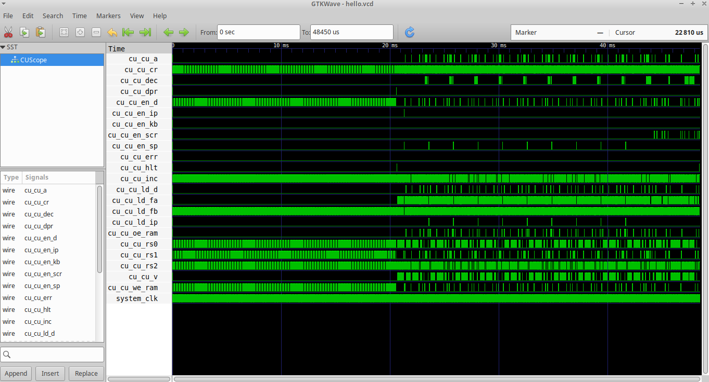

# Rinku

<p align="center"></p>


## Introduction
Rinku is a C++ header-only library designed to simplify the creation of cycle-accurate, event-driven computational systems. By defining *signals* and *modules* that communicate via well-defined interfaces, Rinku enables you to compose complex hardware-like architectures entirely in C++, with automatic propagation of signal changes and clock-driven update semantics. Additionally, signals can be monitored during runtime and exported as a VCD file for visual inspection and debugging using a tool like [GTKWave](https://gtkwave.sourceforge.net/).

### Motivation
The library was developed for aid in prototyping and debugging a custom designed breadboard computer, inspired by Ben Eater's 8-bit computer. The resulting system has been added as one of the examples (bfcpu) and has proven this library to be a valuable tool in the development of such systems (at least for me). More information about the bfcpu-project can be found on [Github](https://github.com/jorenheit/bfcpu). To incorporate the microcode for the BFCPU into the simulated system, [Mugen](https://github.com/jorenheit/mugen) was used to generate the `microcode.h` and `microcode.cc` source files.

### :warning: Warning :warning:
Rinku models all signals and gates as ideal, zero-delay logic. It does not simulate real-world propagation delays, so any circuit that depends on precise timing (for example, a JK flip-flop built purely from AND/OR/NOR gates) will dead-lock or behave incorrectly under Rinku’s update model. If you need a working JK flip-flop (or other timing-dependent component), you should encapsulate it as a single Rinku module whose internals you implement programmatically (e.g. by sampling inputs on clock edges).

## Installation
Follow these steps to get Rinku up and running on your machine:

1. **Clone the repository**

   ```sh
   git clone https://github.com/jorenheit/rinku.git
   cd rinku
   ```

2. **Install headers system‑wide**

   By default the headers will be installed under `/usr/local/include/rinku`:

   ```sh
   # Install to the default prefix (/usr/local)
   make install
   ```

3. **Verify the installation**

   After installation, you should be able to include Rinku headers in your projects as:

   ```cpp
   #include <rinku/rinku.h>
   #include <rinku/util/bus.h>
   ```

4. **Build the examples**

   We provide a couple of  examples in the `examples/` folder. These examples use relative paths for including the Rinku headers, so you don't have to install the headers to your systems include directory to compile and run them.

   - **Hello‑World**
     ```sh
     cd examples/hello-world
     make         # produces the `hello` executable
     ./hello      # run the example
     ```

   - **BFCPU Emulator**
     ```sh
     cd examples/bfcpu
     make                         # produces the `bfcpu` executable
     ./bfcpu programs/hello.bin   # run `hello world` on the emulator
     ```

Once installed, you can add Rinku to your own projects simply by including the headers and compiling with C++20.


## Workflow

A typical Rinku-based simulation involves these steps:

1. **Define module types** with their input and output signals (using `INPUT`, `OUTPUT`, etc.).
2. **Add modules** to a `Rinku::System`.
3. **Connect** inputs to outputs (or constants) across modules to form your signal topology.
4. **Initialize** the system by calling `system.init()` to lock the configuration and reset internal state.
5. **Run** the simulation cycle-by-cycle via `system.run()`, optionally handling halts and resumes.

## Use of Macro's and Namespaces
Because Rinku is a template-heavy library which might scare some less experienced C++ programmers, macro's are available to provide a consistent and easy-to-use syntax. All macro's start with the `RINKU_` prefix, unless the preprocessor constant `RINKU_REMOVE_MACRO_PREFIX` has been defined prior to including the main Rinku header file.

  ```cpp
  #define RINKU_REMOVE_MACRO_PREFIX
  #include <rinku/rinku.h>
  
  // RINKU_INPUT() is now available as INPUT()
  ```
Furthermore, all types defined by Rinku are in the `Rinku` namespace. Simply use a `using namespace Rinku` directive to make them available to the namespace you're working from. The examples in this guide will assume that the macro has been defined and the Rinku namespace is imported.

## Compiletime vs. Runtime 
The setup of the system can only be done at compiletime. Signals are compiletime entities (types) which are passed as template parameters, so these functions cannot be called at runtime using runtime-determined signals. This was a deliberate choice; the compiler will catch a lot of wiring mistakes because it knows which signals belong to which modules, if these are inputs or outputs, etc. Rinku is therefore not meant as a backend for a dynamic system-building experience.

Once the system is built, it can be interacted with during runtime if you choose to. Many access-function have compiletime and runtime variants. If you have all the information at compiletime, simply use the corresponding compiletime variants (or macro's) as this is the fastest way to run your system (no name-lookups). If you're buildig a more advanced and interactive experience, runtime variants are available (and no macro aliases). For more information on these advanced features, see the corresponding chapter and function references at the end of this document.

## Creating a Module
To create a new module to be part of a system we take the following steps:
1. Define input and output signals for the module.
2. Define the module by deriving a new class from the Rinku::Module base-class.
3. Define the module behavior by implementing some functions.

### Step 1: Define Signals
Rinku represents each signal as a strongly-typed struct, carrying a fixed bit-width. Macro's have been provided to simplify the declarations of new signals. 

  ```cpp
  INPUT(MyInput, 8); // MyInput is now available as an 8-bit input-signal
  OUTPUT(MyOutput, 16); // MyOutput is now available as a 16-bit output-signal
  ```

### Step 2: Define Module-Class
To define a new module type as a class, the input and output signals have to be combined in a `SIGNAL_LIST` so they can be passed to the `Rinku::Module<>` base-class. The `SIGNAL_LIST` macro takes the list-name as its first argument, followed by all the signals (previously declared using `INPUT` and `OUTPUT`) that need to be part of this list. A signal-list should contain only 1 type of signal, either inputs or outputs but not both.

  ```cpp
  SIGNAL_LIST(ModuleInputSignals, In1, In2, In3);
  SIGNAL_LIST(ModuleOutputSignals, Out1, Out2, Out3);
  ```
After defining the lists, we can declare our new module, where the `MODULE` macro can be used to handle the derivation details.:

  ```cpp
  class MyModule: MODULE(ModuleInputSignals, ModuleOutputSignals) {
	  // ...
  };
  ```
If you prefer to use normal C++ inheritance syntax, do not forget to derive publicly from the `Rinku::Module`:

  ```cpp
  class MyModule: public Rinku::Module<ModuleInputSignals, ModuleOutputSignals> 
  {
      // ...
  };
  ```
### Step 3: Module Behavior
To define the module behavior, virtual functions from the Module baseclass may be overridden. Macro's have been provided to handle the C++ syntax for you, but of course you are free to use regular C++ as well (optionally using the `virtual` and `override` keywords):

1. **`void clockRising()`/`ON_CLOCK_RISING()`** and **`void clockFalling()`/`ON_CLOCK_FALLING()`** <br/> 
These functions are called every time the clock changes state. Because the order in which the modules are clocked is undefined, the implementation of these functions should not affect its outputs, which in turn may affect other modules depending on the order in which the modules are clocked. Datamembers should therefore be used to keep track of its internal state, which are only made available on the output signals when `update()` is called (see below).
2. **`void update(GuaranteeToken token)`** or **`UPDATE()`** <br/>
This function is called in-between clock state-changes and should handle signal propagation within the module. The system will repeatedly call the update-function on all modules until all module-outputs have settled into a stable state. In general, this is the place where the outputs of the module are set, while the clock-functions above are used to change the internal state without affecting the outputs (which could affect other modules). The guarantee-token is a token that can be set using `token.set()` to indicate that the update-function is guaranteed to have fully settled the module's output. This is equivalent to stating that the update-function is independent from input from other modules (and therefore `getInput`/`GET_INPUT` are never called in its body). By making this promise, the runtime can significantly cut down on the number of updates it needs to guarantee a fully settled down system. If you're using the `UPDATE()` macro, the guarantee can be set using `GUARANTEE_NO_GET_INPUT()` (preferably at the top of the function).
3. **`void reset()`** or **`RESET()`** <br/>
This function is called on initialization or when `System::reset()` is used to reset the entire system. It should make sure that the module resets to some known predefined state.

Inside these functions, inputs and outputs can be read using functionality from the `Rinku::Module` base-class. Each of these functions has a macro-substitute for better error-messages and simpler syntax (for runtime equivalents, see below).

| C++                        | Macro                       | Description                                                   |
|----------------------------|-----------------------------|---------------------------------------------------------------|
| `getInput<Signal>()`       | `GET_INPUT(Signal)`         | Returns signal-value on the given input (0 if not connected). |
| `getOutput<Signal>()`      | `GET_OUTPUT(Signal)`        | Returns the value currently on the given output.              |
| `setOutput<Signal>(value)` | `SET_OUTPUT(Signal, value)` | Sets the given output to `value`.                             |

#### `signal_t`
The output-signals are stored internally as 64-bit integers (`uint64_t`). The type `Rinku::signal_t` has been provided as a type alias for convenience; this is the return-type for `getInput` and the expected type for `value` when setting outputs.

### Examples
#### Example 1: Counter

  ```cpp
  OUTPUT(COUNT_OUT, 8);
  SIGNAL_LIST(CounterOutput, COUNT_OUT);
  
  class Counter: MODULE(CounterOutput) {
	unsigned char count = 0;
  public:
	ON_CLOCK_RISING() {
	  ++count;
	}
  
	UPDATE() {
	  GUARANTEE_NO_GET_INPUT();
	  SET_OUTPUT(COUNT_OUT, count);
	}
	
	RESET() {
	  count = 0;
	}
	
	/* Regular C++ version of update */
	virtual void update(GuaranteeToken token) override {
	  token.set();
	  setOutput<COUNT_OUT>(count);
	}
  };
  ```


#### Example 2: AND Gate
  
  ```cpp
  INPUT(AND_IN_A, 1);
  INPUT(AND_IN_B, 1);
  OUTPUT(AND_OUT, 1);
  
  SIGNAL_LIST(AndInputs, AND_IN_A, AND_IN_B);
  SIGNAL_LIST(AndOutput, AND_OUT);
  
  class And: MODULE(AndInputs, AndOutput) {
  public:
	UPDATE() {
	  bool a = GET_INPUT(AND_IN_A);
	  bool b = GET_INPUT(AND_IN_B);
	  SET_OUTPUT(AND_OUT, a && b);
	}
  };
  ```
#### Example 3: 8-Bit Register

  ```cpp
  INPUT(REG_DATA_IN, 8);
  INPUT(REG_LD, 1);
  INPUT(REG_EN, 1);
  OUTPUT(REG_DATA_OUT, 8);
  
  SIGNAL_LIST(RegisterInputs, REG_DATA_IN, REG_LD, REG_EN);
  SIGNAL_LIST(RegisterOutputs, REG_DATA_OUT);
  
  class Register: MODULE(RegisterInputs, RegisterOutputs) {
	unsigned char const resetValue;
    unsigned char value;
  public:
	Register(unsigned char val = 0):
	  resetValue(val),
	  value(val)
	{}
  
    ON_CLOCK_RISING() {
	  if (GET_INPUT(REG_LD)) {
	    value = GET_INPUT(REG_DATA_IN);
	  }
	}
	
	UPDATE() {
	  SET_OUTPUT(REG_DATA_OUT, GET_INPUT(REG_EN) ? value : 0);
	}
	
	RESET() {
	  value = 0;
	}
  };
  ```
### Predefined Modules
A few convenient modules that are ready for use can be included from the `rinku/logic` and `rinku/util` folders. Below is an overview of these modules and their signals.

| Module        | Namespace      | Inputs (Bits)                             | Outputs (Bits)                              | Header                    |
|---------------|----------------|-------------------------------------------|---------------------------------------------|---------------------------|
| `And`         | `Rinku::Logic` | `AND_IN_A (1)`, `AND_IN_B (1)`            | `AND_OUT (1)`                               | `<rinku/logic/logic.h>`   |
| `Or`          | `Rinku::Logic` | `OR_IN_A (1)`, `OR_IN_B (1)`              | `OR_OUT (1)`                                | `<rinku/logic/logic.h>`   |
| `Xor`         | `Rinku::Logic` | `XOR_IN_A (1)`, `AND_IN_B (1)`            | `XOR_OUT (1)`                               | `<rinku/logic/logic.h>`   |
| `Switch`      | `Rinku::Util`  |                                           | `SWITCH_OUT (1)`                            | `<rinku/util/switch.h>`   |
| `Bus`         | `Rinku::Util`  | `BUS_DATA_IN (64)`                        | `BUS_DATA_OUT (64)`                         | `<rinku/util/bus.h>`      |
| `Splitter<N>` | `Rinku::Util`  | `SPLITTER_IN (64)`                        | `SPLITTER_OUT_X (1)`</br>(`X` from 0 to 63) | `<rinku/util/splitter.h>` |
| `Joiner<N>`   | `Rinku::Util`  | `JOINER_IN_X (1)` <br/>(`X` from 0 to 63) | `JOINER_OUT (64)`                           | `<rinku/util/joiner.h>`   |

#### Switch Members
The `Switch` module does not have inputs that it acts upon. Instead, it can be operated using the functions `Switch::set(bool)` or `Switch::toggle()`.

#### `Splitter<N>` and `Joiner<N>`
Even though all splitters and joiners have 64 inputs/outputs available, the template parameter `N` should signify the number of inputs that are connected. When processing inputs and outputs, these classes will only update the first `N` inputs and outputs to optimize for speed.


## Building the System
### Step 1. Create a System Object

Once all modules have been defined, a system can be built by creating instances of these modules. First, we need to define a new `Rinku::System` object:

  ```cpp
  using namespace Rinku;
  
  System build() {
    System sys;
	// setup the system (see below)
  }
  ```
Alternatively, we can derive our own class from `System` and set it up in its constructor:

  ```cpp
  using namespace Rinku;
  
  class MySystem: public System {
  public:
    MySystem() {
	   // setup the system in the constructor
	}
  };
  ```
  
### Step 2. Add Module Instances to the System
Next, we use the `System::addModule` function-template to instantiate modules and add them to the system. This function returns a reference to the newly created module. For your convenience, it is recommended to use `auto&` to avoid typing the type more than once:

  ```cpp
  MySystem::MySystem() {
	auto& regA    = addModule<Register>();
	auto& regB    = addModule<Register>(42); // constructor argument
	auto& andGate = addModule<And>();
	
	// add more modules to the system, connect, init (see below)
  }
  ```
  
For completion's sake, macro's have been provided to add modules as well but should be used with care. In contrast to other macro's they do not expand to a complete statement; a parameter list that should be passed to the added module's constructor should be added explicitly.

| C++                          | Macro                          | Description                            |
|------------------------------|--------------------------------|----------------------------------------|
| `addModule<Module>(...)`     | `ADD_MODULE(Module)(...)`      | Add module to the system.              |
| `sys.addModule<Module>(...)` | `ADD_MODULE(sys, Module)(...)` | Add module explicitly to `sys` object. |

  ```cpp
  // From a member in a class deriving from System
  auto& regA = ADD_MODULE(Register)();   // no arguments to Register
  auto& regB = ADD_MODULE(Register)(42); // pass 42 to the Register constructor
  
  // Or when building a system object seperately
  System system;
  auto& regA = ADD_MODULE(system, Register)(42);
  ```

#### Labeled Modules
A module can be labeled by passing a string as the first argument to `addModule` (this also works with the macro `ADD_MODULE`). At a later point in your code, a reference to that module can then be obtained using the `getModule` function template. There is no macro replacement for this function.

  ```cpp
  MySystem::MySystem() {
	auto& regA = addModule<Register>("regA", 42); // label is first parameter
	// ...
  }
  
  void foo(MySystem &sys) {
	auto& regA = sys.getModule<Register>("regA");
	// ...
  }
  ```
  
##### Parameter Ambiguities
In cases when the first argument of the module constructor is also string-like, the meaning of the arguments passed to `addModule` might become ambiguous. The compiler will try to figure out what you meant and tell you if the call is ambiguous, in which case you can use `addModuleNamed` and `addModuleUnnamed`. The general advice here is to not think about this until the compiler tells you to (in which case there's an easy fix).

### Step 3. Make Connections
The system topology is defined by connections between inputs and outputs of different modules (you can even wire modules to themselves if you want). To make a new connection, regular C++ or a macro may be used. 

| C++                                    | Macro                                       | Description                                                                  |
|----------------------------------------|---------------------------------------------|------------------------------------------------------------------------------|
| `mod.connect<Input, Output>(otherMod)` | `CONNECT_MOD(mod, Input, otherMod, Output)` | Connect `mod`'s input-signal `Input` to `otherMod`'s output-signal `Output`. |
| `mod.connect<Input, 1>()`              | `CONNECT_CONST(mod, Input, 1)`              | Connect `mod`'s input-signal `Input` to a constant signal with value `1`.    |

  ```cpp
  // C++
  andGate.connect<AND_IN_A, 1>();
  andGate.connect<AND_IN_B, 1>();
  regA.connect<REG_DATA_IN, REG_DATA_OUT>(regB);
  regB.connect<REG_EN, AND_OUT>(andGate);

  // Or when using macro's
  CONNECT_CONST(andGate, AND_IN_A, 1);
  CONNECT_CONST(andGate, AND_IN_B, 1);
  CONNECT_MOD(regA, REG_DATA_IN, regB, REG_DATA_OUT);
  CONNECT_MOD(regB, REG_EN, andGate, AND_OUT);
  ```
#### Inverted Outputs
Sometimes it makes sense to connect inputs to inverted outputs. You could design a module to act as an inverter but for convenience the `Rinku::Not<>` template, or `RINKU_NOT()` macro have been provided. When connecting a module to a negated output, simply wrap the output-signal in either the template or macro, depending on preference.

  ```cpp
  regA.connect<REG_EN, Not<AND_OUT>>(andGate);
  CONNECT(regA, REG_EN, andGate, NOT(AND_OUT));
  ```

#### Multiple Outputs to a Single Input
Rinku allows connecting multiple outputs to a single input. This is necessary for instance when creating a module that acts like a bus. When an input connects to multiple outputs, its resulting value is the bitwise OR of each of the outputs of the connected to it.

### 4. Special System Connections
The `System` is itself a module and has 4 input-signals (no outputs): `SYS_HLT`, `SYS_ERR`, `SYS_EXIT` and `SYS_EXIT_CODE`. These input signals can be connected to output signals in order to make the system halt, exit with an error or exit gracefully when issued. The system's `run()` function will return the value present at the `SYS_EXIT_CODE` input (8 bits). Special connect-functions are available in the System interface to make these connections, though they can also be made like any other connection (see above).

| C++                                   | Macro                                   | Description                                                   |
|---------------------------------------|-----------------------------------------|---------------------------------------------------------------|
| `connectHalt<Signal>(module)`         | `SYSTEM_HALT(Signal, module)`           | Connect the halt-signal                                       |
| `sys.connectHalt<Signal>(module)`     | `SYSTEM_HALT(sys, Signal, module)`      | Connect the halt-signal to a standalone `System` object.      |
| `connectError<Signal>(module)`        | `SYSTEM_ERROR(Signal, module)`          | Connect the error-signal                                      |
| `sys.connectError<Signal>(module)`    | `SYSTEM_ERROR(sys, Signal, module)`     | Connect the error-signal to a standalone `System` object.     |
| `connectExit<Signal>(module)`         | `SYSTEM_EXIT(Signal, module)`           | Connect the exit-signal                                       |
| `sys.connectExit<Signal>(module)`     | `SYSTEM_EXIT(sys, Signal, module)`      | Connect the exit-signal to a standalone `System` object.      |
| `connectExitCode<Signal>(module)`     | `SYSTEM_EXIT_CODE(Signal, module)`      | Connect the exit-code-signal (8-bit)                          |
| `sys.connectExitCode<Signal>(module)` | `SYSTEM_EXIT_CODE(sys, Signal, module)` | Connect the exit-code-signal to a standalone `System` object. |


In the example below, it is assumed that these connections are made inside a member (e.g. the constructor) of a class derived from `System`. If using a standalone `System` object, these functions can be called on that object instead.

  ```cpp
  // Using dedicated System members 
  connectHalt<AND_OUT>(andGate);  // halt when the And-gate goes high
  connectError<AND_OUT>(andGate); // error when the And-gate goes high
  connectExit<AND_OUT>(andGate);  // exit when the And-gate goes high
  connectExitCode<REG_OUT>(regA); // return value from regA when done
  
  // Using normal connect syntax
  connect<SYS_HLT, AND_OUT>(andGate); 
  // similarly for SYS_ERR, SYS_EXIT and SYS_EXIT_CODE
  
  // Using macro's
  SYSTEM_HALT(AND_OUT, andGate);
  SYSTEM_ERROR(AND_OUT, andGate);
  SYSTEM_EXIT(AND_OUT, andGate);
  SYSTEM_EXIT_CODE(REG_OUT, regA);

  // Using macro's on a System object
  System system;
  //...
  SYSTEM_HALT(system, AND_OUT, andGate);
  SYSTEM_ERROR(system, AND_OUT, andGate);
  SYSTEM_EXIT(system, AND_OUT, andGate);
  SYSTEM_EXIT_CODE(system, REG_OUT, regA);
  
  ```

## Running

When the system is fully setup, it can be initialized and run using the `System::init()` and `System::run()` functions. For example:

  ```cpp
  
  class MySystem: public System {
  public:
    MySystem() {
	   // Build the system by adding and connecting modules
	   init(); // initialize -> will lock the topology and reset all modules
	}
  };
  
  int main() {
	MySystem sys;
	int ret = sys.run();
	std::cout << "System finished with exit code " << ret << '\n';
  }
```

## Advanced Features
### Single Stepping the System
Instead of calling `run` and letting the system run its course, it is also possible to single-step (`System::step()`) or even half-step (`System::halfStep()`) the system. This makes it possible to inspect the system while it is running. Signals can be retrieved using `getInput` or even set using `setOutput` to inject signals into the system that would normally not have been there. When either the exit or error signal connected to the system goes high, `step()` and `halfStep()` will return false and it is up to you to act accordingly. For example:

  ```cpp
  while (sys.step()) {
    auto& reg = sys.getModule<Register>("regA");
    std::cout << "A Register: " << reg.getOutput<REG_DATA_OUT>() << '\n';
  }
  return sys.getInput<SYS_EXIT>() ? sys.getInput<SYS_EXIT_CODE> : -1;
  ```

### Runtime Get/Set Variants 
Up to this point, all the methods for retrieving the values at module inputs or changing module outputs have been compile-time features. By writing `module.getInput<IN_A>`, the compiler can check if `IN_A` is indeed an input for this module and if so, it knows where the value is stored; no look-ups required. This is great for performance but takes away some of the flexibility. To re-introduce this flexibility and allow for programs to get/set inputs and outputs interactively, the following runtime alternatives are available in all classes derived from `MODULE` (`Module<>`).

| Compiletime Function       | Runtime Alternative          |
|----------------------------|------------------------------|
| `getInput<Signal>()`       | `getInput("Signal")`         |
| `getOutput<Signal>()`      | `getOutput("Signal")`        |
| `setOutput<Signal>(value)` | `setOutput("Signal", value)` |
|                            |                              |

The input-strings are simply the stringified Signal-names, e.g. `INPUT(IN_A)` defines input `IN_A` which will be available at runtime as `"IN_A"`.

### VCD File Export
The VCD (Value Change Dump) format is a file-format designed to log the history of logic-signals and can be parsed and displayed visually by tools like [GTKWave](https://gtkwave.sourceforge.net/). Rinku provides the `VcdScope` class which can be used to monitor output signals while the system is running. The resulting logs can then be exported directly to the VCD file format as a `std::string` which can be written to an output stream. The scopes have to be connected before the system is initialized and cannot be managed dynamically (it is part of the system's static topology). To create a new scope, use `System::addScope("ScopeName")`, which will add a scope by the given name and returns a reference to this scope. The scope-name is mandatory as it will be used in the resulting VCD file, but can also be used to retrieve a scope by its name elsewhere in the code (so you don't need to manage the resulting references yourself) using `System::getScope("ScopeName").

After a scope has been attached, you can tell it to monitor certain signals using its `monitor` member, which comes in 2 different flavors:
* Monitor the entire module (all of its output) using `monitor(mod)`.
* Monitor a subset of its output signals using `monitor<Output1, Output2, ...>(mod)`.

  ```cpp
  MySystem::MySystem() {
    auto& regA = addModule<Register>();
    auto& regB = addModule<Register>();
    
    // rest of the system
    auto& scopeA = addScope("Register A Scope");
    auto& scopeB = addScope("Register B Scope");

    scopeA.monitor(regA); // all outputs of regA will be logged
    scopeB.monitor<REG_DATA_OUT>(regB); // only log REG_DATA_OUT on regB
  }
  ```

When the system is done running, the VCD-string can be generated by calling `System::vcd()` on your system-object and optionally pass a list of scopes that you want to export the data from. This can be done by reference (if you still have the returned reference at hand) or by label (at the risk of an exception being thrown if that label is incorrect). If no arguments are passed to `vcd()`, all scopes attached to the system will be used.

  ```cpp
  int main() {
    MySystem sys;
    sys.run();
    VcdScope &scopeA = sys.getScope("Register A Scope");
    std::cout << sys.vcd(scopeA, "Register B Scope"); 
  }
  ```
#### Example VCD Visualization
Once the VCD file has been written, it can be inspected by a tool like [GTKWave](https://gtkwave.sourceforge.net/). The screenshot below shows the control-unit output `bfcpu` example while running the `Hello World` program.

<p align="center"></p>


### Error Handling
When dealing with runtime arguments like labels to refer to modules or signals, exceptions will be thrown when for example a label does not match any of the managed objects. Each of these exceptions is derived from `Rinku::Error::Exception` and provides a `what()` member that returns a string with a detailed error message. To simply abort execution whenever any error occurs, one could wrap the `main` function in a `try`-`catch` block as follows:

  ```cpp
  int main() try {
    MySystem system;
	system.run();
  } catch (Rinku::Error::Exception &e) {
    std::cerr << e.what() << '\n';
  }
  ```
  
For more fine-grained control in interactive implementations, different actions can be taken depending on the type of errors thrown. Below is a list of exception-types and the functions that might throw them. Each of these is part of the `Rinku::Error` namespace.

| Exception                | Might Throw                                                        | When                                             |
|--------------------------|--------------------------------------------------------------------|--------------------------------------------------|
| `SystemLocked`           | `Module::connect`</br>`VcdScope::monitor`                          | Tried to modify topology after `System::init()`. |
| `SystemNotInitialized`   | `System::run`</br>`System::step`</br>`System::halfStep`            | Tried to run before `System::init()`.            |
| `OutputChangeNotAllowed` | `Module::setOutput`                                                | Tried to change outputs in clock-handler.        |
| `InvalidSignalName`      | `Module::setOutput`</br>`Module::getOutput`</br>`Module::getInput` | Module does not contain signal by this label.    |
| `InvalidModuleName`      | `System::getModule`                                                | System does not contain a module by this label.  |
| `InvalidScopeName`       | `System::getScope`                                                 | System does not contain a scope by this label.   |
| `DuplicateModuleNames`   | `System::addModule`                                                | A module by this label already exists.           |
| `DuplicateScopeNames`    | `System::addScope`                                                 | A scope by this label already exists.            |
| `InvalidModuleType`      | `System::getModule<T>`                                             | The module cannot be downcast to `T`.            |


## Function Reference
### `class System`
| Method                                                                                                                  | Return        | Description                                                                                                                                                                                                                                               |
|-------------------------------------------------------------------------------------------------------------------------|---------------|-----------------------------------------------------------------------------------------------------------------------------------------------------------------------------------------------------------------------------------------------------------|
| `System([freq])`                                                                                                        |               | System constructor; optionally pass a frequency to be used when generating VCD.                                                                                                                                                                           |
| `addModule<ModuleType>(args...)`</br>`ADD_MODULE(ModuleType, args ...)`</br>`ADD_MODULE(system, ModuleType, args ...)`  | `ModuleType&` | Add a module to the system and return a reference to the module.</br>Optionally: pass a label as its first argument, followed by constructor arguments.</br>Might throw `DuplicateModuleNames`.                                                           |
| `getModule<ModuleType>("label")`                                                                                        | `ModuleType&` | Returns a reference to the module with the label `"label"`.</br>Might throw `InvalidModuleName`, `InvalidModuleType`.                                                                                                                                     |
| `connectHalt<Signal>(module)`</br>`SYSTEM_HALT(Signal, module)`</br>`SYSTEM_HALT(system, Signal, module)`               | `void`        | Connect `Signal` from `module` to the `SYS_HLT` input of the system.                                                                                                                                                                                      |
| `connectError<Signal>(module)`</br>`SYSTEM_ERROR(Signal, module)`</br>`SYSTEM_ERROR(system, Signal, module)`            | `void`        | Connect `Signal` from `module` to the `SYS_ERR` input of the system.                                                                                                                                                                                      |
| `connectExit<Signal>(module)`</br>`SYSTEM_EXIT(Signal, module)`</br>`SYSTEM_EXIT(system, Signal, module)`               | `void`        | Connect `Signal` from `module` to the `SYS_EXIT` input of the system.                                                                                                                                                                                     |
| `connectExitCode<Signal>(module)`</br>`SYSTEM_EXIT_CODE(Signal, module)`</br>`SYSTEM_EXIT_CODE(system, Signal, module)` | `void`        | Connect `Signal` from `module` to the `SYS_EXIT_CODE` input of the system.                                                                                                                                                                                |
| `init()`                                                                                                                | `void`        | Initialize and lock the system.                                                                                                                                                                                                                           |
| `reset()`                                                                                                               | `void`        | Reset the system.                                                                                                                                                                                                                                         |
| `run(resumeOnHalt = false)`                                                                                             | `signal_t`    | Run continuously until halted or an error occurs.</br>If `resumeOnHalt` is `true`, the `SYS_HLT` signal is ignored.</br>Returns the signal asserted on its `SYS_EXIT_CODE` input, or `-1` on error.</br>Might throw `SystemNotInitialized`.               |
| `step(resumeOnHalt = false)`                                                                                            | `bool`        | Single-step the system (rising edge followed by falling clock edge).</br>If `resumeOnHalt` is `true`, the `SYS_HLT` signal is ignored.</br>Returns `true` unless the `SYS_ERR` or `SYS_EXIT` signal was asserted.</br>Might throw `SystemNotInitialized`. |
| `halfStep(resumeOnHalt = false)`                                                                                        | `bool`        | Half-step the system (alternating rising and falling edge).</br>If `resumeOnHalt` is `true`, the `SYS_HLT` signal is ignored.</br>Returns `true` unless the `SYS_ERR` or `SYS_EXIT` signal was asserted.</br>Might throw `SystemNotInitialized`.          |
| `addScope("name")`                                                                                                      | `VcdScope&`   | Adds a `VcdScope` to the system and returns a reference. Might throw `DuplicateScopeNames`.                                                                                                                                                               |
| `getScope("name")`                                                                                                      | `VcdScope&`   | Returns a reference to the `VcdScope` object with label `"name"`. Might throw `InvalidScopeName`.                                                                                                                                                         |
| `vcd(scope1, "scope2", ...)`                                                                                            | `std::string` | Returns a VCD-formatted string that can be parsed by VCD-viewers like GTKWave.</br>Arguments may be `VcdScope&` or labels (strings) in any order.</br>Might throw `InvalidScopeName`.                                                                     |

	
### `class Module<>`
| Method                                                                                             | Return     | Description                                                                                  |
|----------------------------------------------------------------------------------------------------|------------|----------------------------------------------------------------------------------------------|
| `connect<Input, Output>(outputModule)`</br>`CONNECT_MOD(inputModule, Input, outputModule, Output)` | `void`     | Connect `Input` of the module to `Output` of `outputModule`.</br>Might throw `SystemLocked`. |
| `connect<Input, Value>()`</br>`CONNECT_CONST(inputModule, Input, Value)`                           | `void`     | Hardwire `Input` to constant `Value`.                                                        |
| `setOutput<Output>(value)`</br>`SET_OUTPUT(value)`                                                 | `void`     | Set `Output` to `value`.                                                                     |
| `setOutput("Output", value)`                                                                       | `void`     | Set output by label to `value`.</br>Might throw `InvalidSignalName`.                         |
| `getOutput<Output>()`</br>`GET_OUTPUT(Output)`                                                     | `signal_t` | Returns the value currently at the given `Output`.                                           |
| `getOutput("Output")`                                                                              | `signal_t` | Get output by label.</br>Might throw `InvalidSignalName`.                                    |
| `getInput<Input>()`</br>`GET_INPUT(Input)`                                                         | `signal_t` | Get value currently on `Input`.                                                              |
| `getInput("Input")`                                                                                | `signal_t` | Get input by label.</br>Might throw `InvalidSignalName`.                                     |


### `class VcdScope`
| Method                          | Return | Description                                                                     |
|---------------------------------|--------|---------------------------------------------------------------------------------|
| `monitor<Output1, ...>(module)` | `void` | Monitor one or multiple outputs on `module`. Might throw `SystemLocked`.        |
| `monitor(module)`               | `void` | Monitor all output signals from the given `module`. Might throw `SystemLocked`. |


